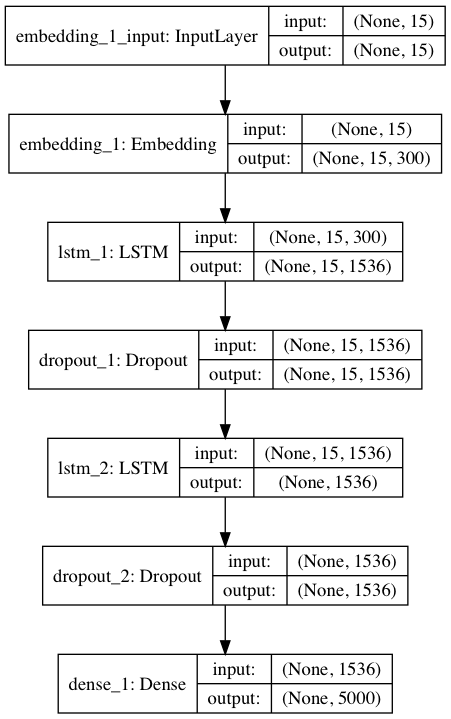

# Neural Politician

Project for generating speeches of austrian politicians with recurrent neural networks.

The project structure is as follows:

* `backend`: Django application of the providing necessary endpoints
* `frontend`: static files composing the 
* `intelligence`: deep neural network architecture and data set utilties
* `infrastructure`: utility file for the necessary infrastructure components
* `neural-politician`: Django settings

In general a stacked recurrent neural network (RNN) was applied to protocol of speeches in the Austrian parlament. Underlying LSTMs had a size of 1526 units, which were trained with a sequence length of 15. The following figure depicts the applied architecture.

Training was done on GPU instances on the Google Compute Engine. The utility script `./intelligence/start.sh` provides neccessary actions for training and executing the neural network.
